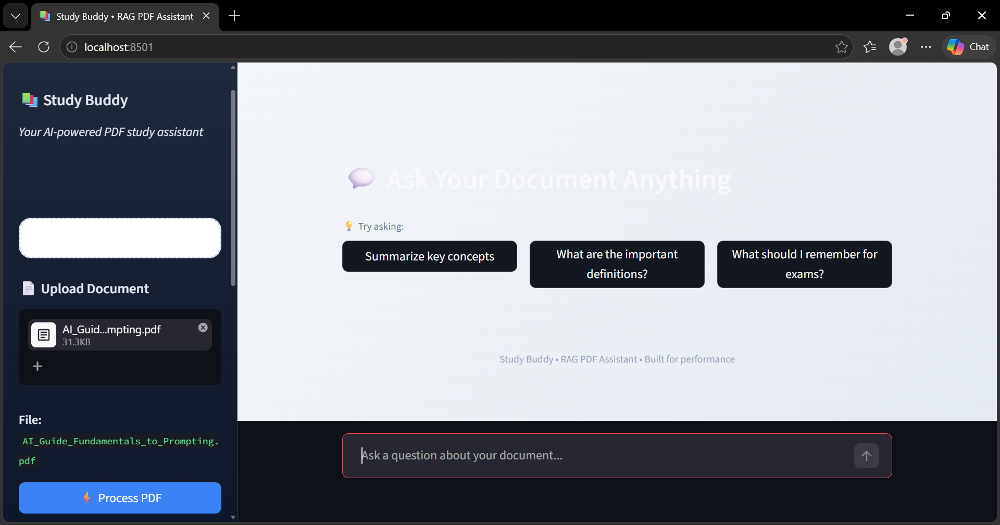

# 🤖 RAG PDF Chatbot with Ollama & ChromaDB

A localized Retrieval-Augmented Generation (RAG) pipeline that allows users to upload PDF documents and have interactive, contextual conversations with their data offline. By leveraging **Ollama** and **ChromaDB**, this system eliminates API costs, bypasses cloud limits, and ensures 100% data privacy.

---

## 🗺️ System Architecture & Pipeline

Below is the design and data flow of the RAG pipeline, demonstrating how documents are processed, indexed, and retrieved locally:



---

## 🌟 Key Features

- **100% Unlimited & Free:** Powered by Ollama (`phi3` / `llama3`), completely removing `429 Quota Exceeded` cloud API limitations.
- **Smart PDF Chunking:** Efficiently parses and splits large academic or business PDF documents into manageable text blocks.
- **Local Vector Database:** Powered by ChromaDB for high-speed, persistent text-vector storage and semantic lookups.
- **Strict Context Control:** Answers user queries based _only_ on the extracted PDF context. If the answer isn't there, it safely alerts the user instead of hallucinating.
- **Privacy First:** No data ever leaves your computer. Perfect for sensitive documents.

---

## 🛠️ Project Structure

```text
rag_pdf_chatbot/
│
├── src/
│   ├── __init__.py
│   ├── pdf_loader.py     # Parses uploaded PDF files
│   ├── chunker.py        # Splits text into smaller operational chunks
│   ├── embedder.py       # Manages vector database insertions (ChromaDB)
│   ├── rag_engine.py     # Local LLM response generator (Ollama Backend)
│   └── gemini_rag.py     # Fallback cloud LLM handler
│
├── data/                 # Ignored by Git (Local directory for database/uploads)
│   ├── uploads/          # Stores the user's PDF documents
│   └── vectorstore/      # Local ChromaDB persistent binaries
│
├── app.py                # UI / Main Application Core
├── rag-pdf-chatbot.png   # Architecture Diagram Image
├── requirements.txt      # Dependencies list
└── .gitignore            # Keeps your environment clean on GitHub
```
